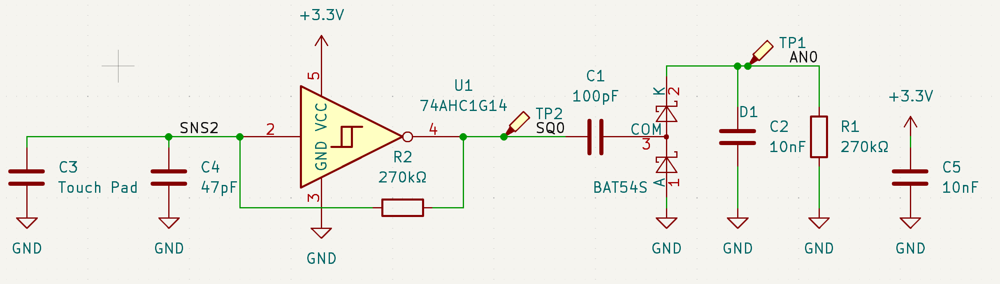
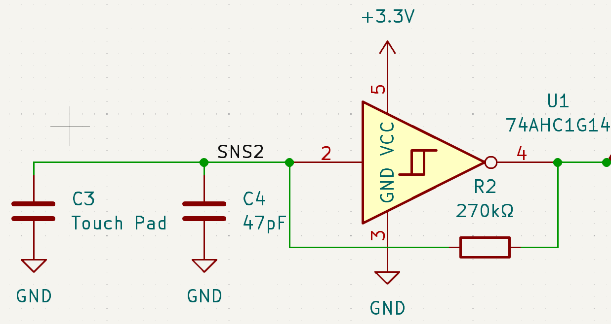
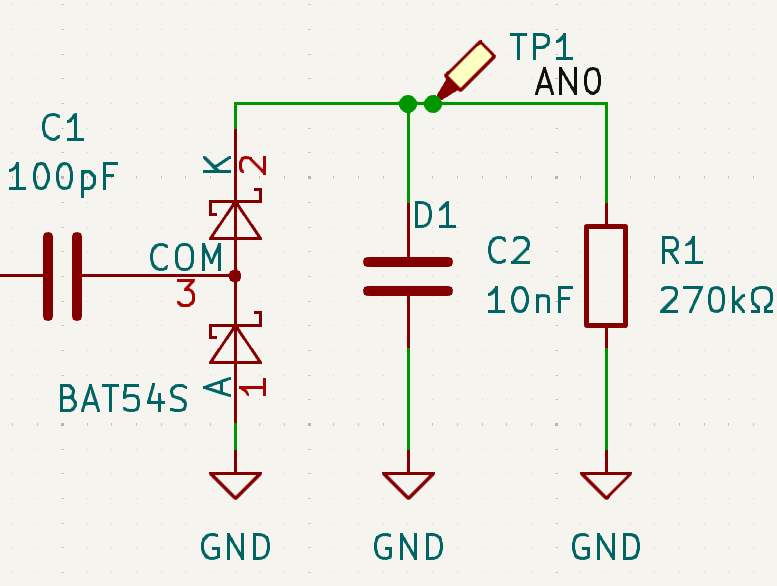
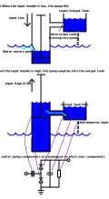

# EEE-Sparkle

## Aim of the lab

This lab activity is an introduction to some principles and techniques in Electronic Engineering. You will build an illuminated artwork that can be controlled with touch sensors and an internet connection. Along the way, you will see how the behaviour of an electronic circuit can be analysed mathmatically, you will assemble some hardware by soldering components to a circuit board, and you will develop a hardware-software interface by writing code for an embedded computer.

### System overview

Electronic systems are often conceptualised as a block diagram, which shows how energy or information flows between various building blocks. A block diagram for the system in this lab activity looks like this:

The main user input is a set of three _touch sensors_, which measure the capacitance of the user's finger and converts it into an electrical signal using an _oscillator_. The frequency of the signal is converted to a voltage with a _charge pump_, and this voltage is measured by a _microcontroller_. The microcontroller detects touches and sets the colour and brightness of two LEDs, which illuminate the artwork.

## The Oscillator

We will begin by building and testing the oscillator. The oscillator repeatedly charges and discharges a capacitor to find out how much electrical charge it can store when a voltage is applied. This quantity, charge per unit voltage, is the _capacitance_, measured in _Farads_. The capacitance in this case is a combination of an electronic component and the capacitance of the user's finger ($C$). The capacitance of a finger is very small and it is best measured in _picofarads_ - trillionths of a Farad. The circuit diagram for the oscillator looks like this:

The active component in the oscillator is an inverter, which measures the input voltage as above or below a certain threshold and sets the output to the logical opposite. If the voltage is below the threshold, the output is set to a high value (3.3V in this case), and if the input exceeds the threshold the output voltage is low: 0V.

Imagine the capacitors C3 and C4 hold no charge ($q$) at first, so the voltage across its terminals is zero. That means the input to the inverter is below the threshold and so the inverter output is set high to 3.3V. Now the resistor R2 comes into action - it connects the inverter output to the capacitor, so current begins to flow into the capacitor, charging it. The magnitude of the current ($i$) is given by the voltage across the resistor terminals divided by the resistance, so at first we have $i = 3.3 \text{V} / 270k\Omega = 12\mu \text{A}$ (1 microamp is 1 millionth of an amp). The current flowing into the capacitor is accumulated as a stored charge, which means the voltage of the capacitor increases according to $V_\text{C} = q/C = 1/C \int i dt$.

After some time, enough charge accumulates in the capacitor so that its voltage exceeds the threshold voltage of the inverter, which around the midpoint of the logical high and low voltages: 1.65V. When this happens, the output of the inverter will switch to 0V and now we have a capacitor charged to 1.65V connected via the resistor to 0V. So the capacitor charging current reverses and becomes a discharging current, causing the capacitor voltage to decrease again. Of course, once the voltage drops below the threshold the inverter will switch again and so the process will continue indefinitely, with the capacitor voltage wavering around the threshold voltage and the inverter output toggling between high and low. This is the purpose of an oscillator, to produce a signal that varies, repetitively, over time.

### Building the Oscillator

Start by building the oscillator just for touch sensor 0. Solder the capactior C4 and resistor R2 to the circuit. The inverter, plus an additional capacitor C5 to stabilise the power input to the circuit, are already fitted for you.

Power up the circuit by connecting a USB cable to the socket on the Raspberry Pi Pico module. The Pico isn't doing anything yet except passing the USB power into the rest of the circuit.

Connect an oscilloscope probe to the proble point for oscillator output 0 on the PCB and attach the ground clip to the bigger loop marked GND. The oscilloscope is already set up to show you the output of the oscillator. If it works, you will see a square wave - the oscillator output alternating between high and low over time. The oscilloscope measures the frequency of oscillation for you and displays the result on the screen - it's the number of times per second that the voltage switches from low to high and back. Touch the sensor pad for channel 0 - you should see the frequency reduce as the increase in capacitance means it takes more charge and more time for the capacitor voltage to rise above and fall below the threshold.

### Oscillator Frequency

The exact relationship between capacitance and oscillator frequency is complicated by two factors.

First, the magnitude of the charging and discharging current is not a constant. The current is directly proportional to the potential difference across the resistor, but as the capacitor charges, this potential difference reduces in magnitude. Including the capacitor voltage in the current calculation gives

$i = \frac{V_\text{out} - V_\text{C}}{R}$

We also have, from earlier, $V_\text{C} = 1/C \int i dt$ so

$V_\text{C} = \int{\frac{V_\text{out} - V_\text{C}}{RC} dt}$ - a differential equation.

The second complication is _hysteresis_. We have established that the capacitor voltage varies slightly above and below the inverter threshold voltage, but by how much? If all the components behaved perfectly and the inverter could detect an infinitesimal difference between input and threshold, the oscillator would switch at an unlimited frequency.

In fact, the inverter has a special type of input called a _schmitt trigger_, and it's designed for this scenario where you want to deliberately desensitise the input a little. It works by introducing a dependency between the threshold voltage and the output voltage. If the output is high, the threshold voltage is reduced slightly and if it's low, the threshold is increased. So there are two threshold voltages and the capacitor voltage will oscillate between them. The difference between them is called the hysteresis and the larger the hysteresis, the lower the frequency of oscillation.

## The Charge Pump

The charge pump makes it easy for the Raspberry Pi to detect touch inputs by converting the oscillator frequency into a steady voltage. If the frequency changes, the voltage will change.

A water pump serves as a useful analogy for the charge pump:

When the pump handle (input voltage) is low, water (charge) flows into the pump to equalise at the ground level. When the handle is raised, the water level inside the pump also increases, and when it exceeds the level of the output reservoir, the water in the pump flows into the reservoir. A non-return valve (diode) prevent the reservoir from discharging back into the pump when the level is lowered. Another valve stops the pump discharging to the ground when the level is high. The output reservoir leaks away through a small hole (resistor).

In a similar way, the charge pump uses a capacitor $C$ to transfer an amount of charge from to the output on every oscillator cycle. The higher the frequency $f$, the more charge is transferred. The pumped charge is held in a reservoir capacitor, where it slowly leaks away through a resistor $R$. The leakage current depends on the voltage of the reservoir and therefore the charge in the reservoir, so the pumped charge and leakage current will, on average, balance and the reservoir voltage $V_\text{out}$ will reach an equilibrium, depending on the frequency.

### Building the Charge Pump

The two diodes for channel 0 are already fitted for you - they are combined into a single device D1 with three pins.

### Analysing the Charge Pump

The charge transferred on each cycle is $Q = (3.3V - V_\text{out})C$, since the high input raises the pump capacitor to 3.3V and it discharges until the pump capacitor and the reservoir capacitor have the same voltage ($V_\text{out}$).

The pump operates once per oscillator cycle with frequency $f$, so the average current transferred is $i = f(3.3V - V_\text{out})C_\text{pump}$

The reservoir leakage current balances the input current, and it depends on the voltage and the resistor: $i = V_\text{out}/R$

Solving for $V_\text{out}$ gives

$V_\text{out} = \frac{3.3}{(1/RfC + 1)}$

That means for low frequencies, $V_\text{out}$ is approximately proportional to $f$. But once $RfC$ grows much over 1, $V_\text{out}$ converges towards 3.3V.

In practice, $V_\text{out}$ will be lower due to effects we haven't considered here, such as energy lost in the diodes.

## The LED Controller